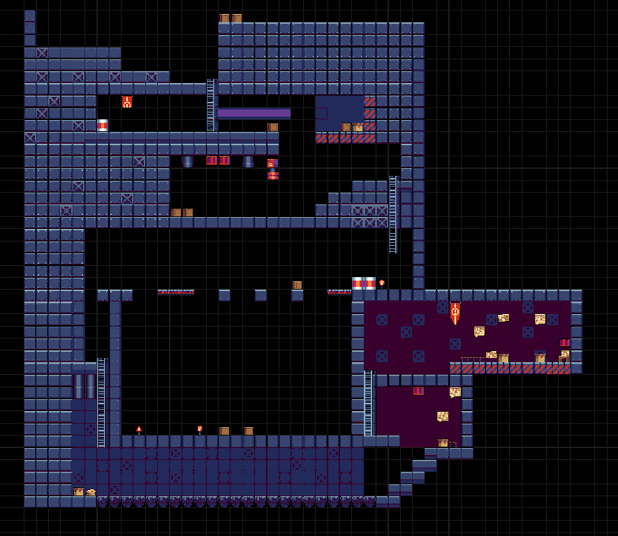

# DEMO DE JOGO 🎮

Um trabalho para a faculdade com o intuíto de entender como um sistema  sistema real, com regras, estados, dados, eventos e organização de código funcionam.
Aqui veremos os seguintes tópicos sendo praticado:

- Bibliotecas e Controle de Versionamento
- Programação Orientada a Objetos e UML
- Módulos, Herança e Design Pattern
- ventos, Decorators e List Comprehension
- SQLite e JSON
- Testes e Geração de arquivo Executável

## Jogo demo feito no Sprite Fusion

